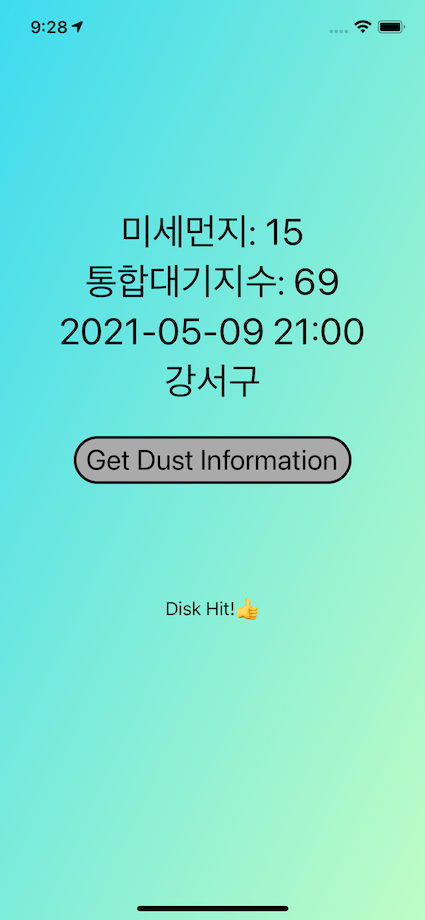
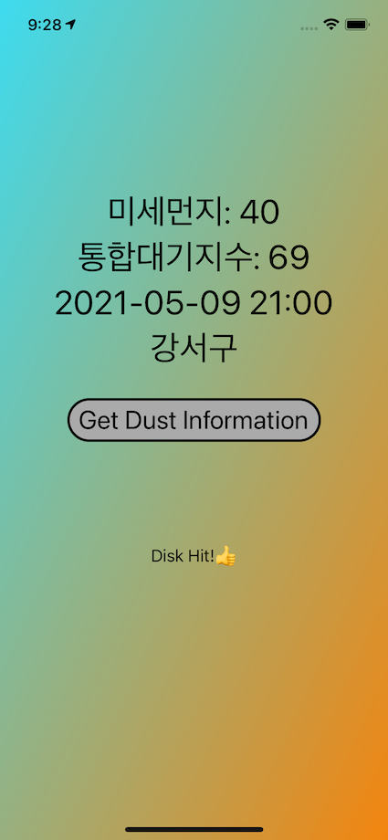
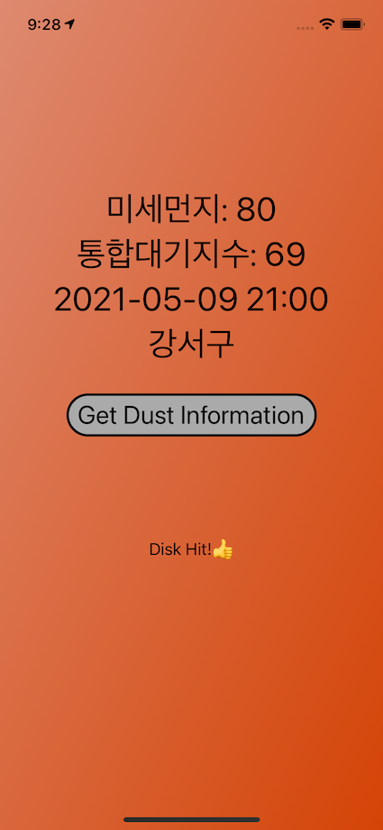
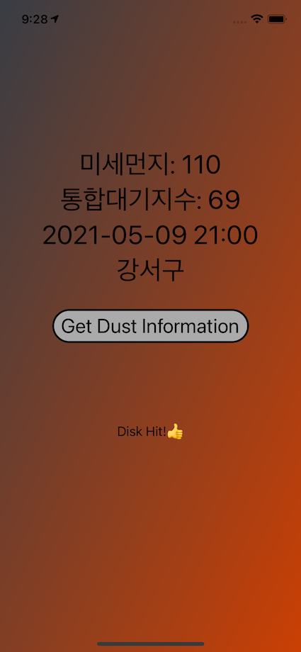

# Purpose 
- To show dust information by local location using Air Korean API 

## Dust Level 1 ~ 4 
   

# Usage 
- There is **no Key** to use API in this project. 
- If you want to use this project, **you should sign up below cite in order to apply API**.
- https://www.data.go.kr/index.do
- And you should apply for using API below 2 cite. 
- ( Don't worry about getting permission. It will no takes time to use API after applying )
- https://www.data.go.kr/data/15073877/openapi.do 
- https://www.data.go.kr/data/15073861/openapi.do
- Then, add global variable naming `KEYEncoding` initialized String type with **key** you get from that cite anywhere you want in project.

# Stack 
- In MVVM, I splited responsibilties among using API and converting Data. 
- In order to get low frequency of calling API, I applied **cache**. 

# origin of source
-  "환경부/한국환경공부"
